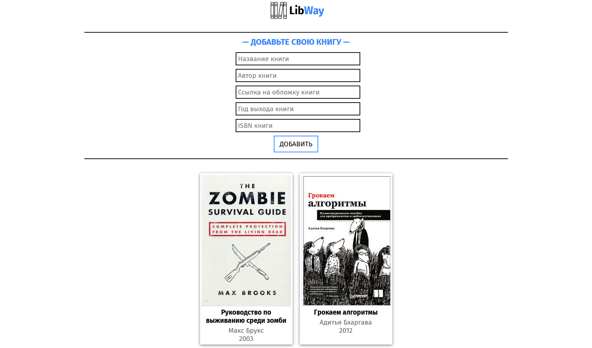
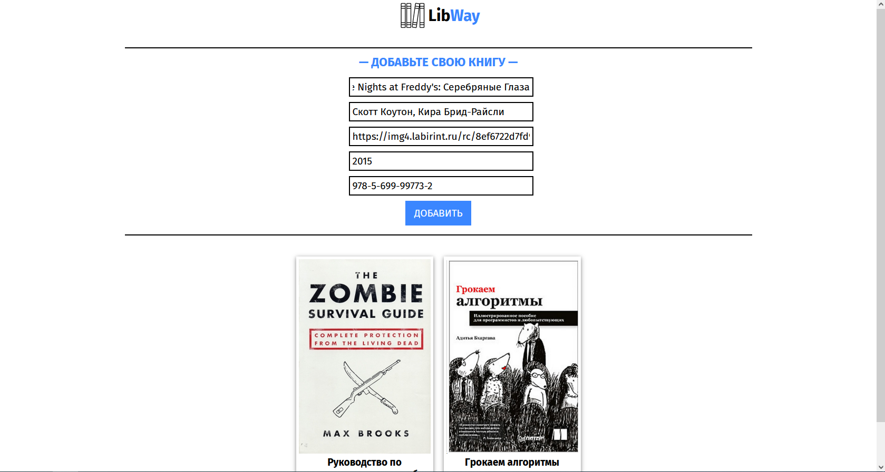
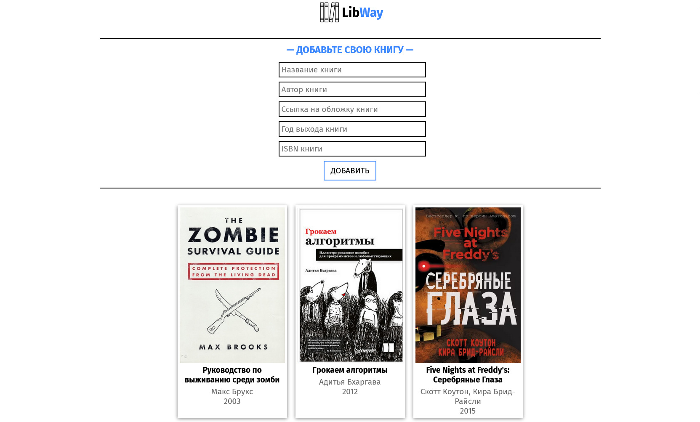

# Объектно-ориентированное программирование, ЛР 3
Разработать страницу отображающую список объектов, с хранением их на сервере в файле, передача данных осуществляется по JSON, клиент и сервер общаются по средствам передачи данных. На странице предусмотреть форму добавления объектов в список. 

## Скриншоты работы программы (список книг)
### Desktop версия
 
 
 
### Мобильная версия
 
